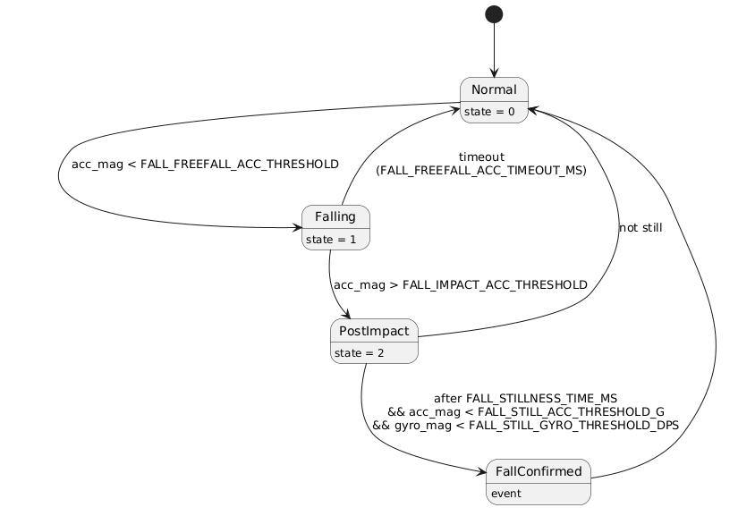

# FallSense

Status: WORK IN PROGRESS – actively under development

FallSense is a low-power embedded system for fall detection, built on an STM32 microcontroller using FreeRTOS.

## Current Features
- I2C-based IMU integration (accelerometer + gyroscope)
- Real-time data acquisition and processing
- Low-pass filtering for noise reduction
- Magnitude-based motion analysis (orientation independent)
- Fall detection using a state machine:
  - Free fall detection
  - Impact detection
  - Post-impact stillness verification
- Configurable thresholds (no hardcoded magic numbers)
- Structured UART logging for debugging
- Deterministic loop timing for stable sampling
---

## Fall Detection State Machine

Source: [PlantUML](Docs/Diagrams/fall_state_machine.puml)

## System Design
The fall detection logic follows a multi-stage approach:
1. Free fall → drop in acceleration magnitude  
2. Impact → sudden spike in acceleration  
3. Stillness → low movement after impact  
A fall is confirmed only if all conditions are met, reducing false positives.
---

## Work in Progress
- Threshold tuning using real-world data
- Orientation (tilt) detection using gyroscope
- Optimization of detection reliability
---

## Planned Features
- Sensor fusion (FSR + IMU) for early fall prediction
- GPS/BLE-based alert system
- Cloud integration (Firebase)
- Low-power optimization (sleep modes, event-driven sensing)
---

## Tech Stack
- STM32 (HAL / CubeIDE)
- Embedded C
- I2C communication
- Real-time signal processing